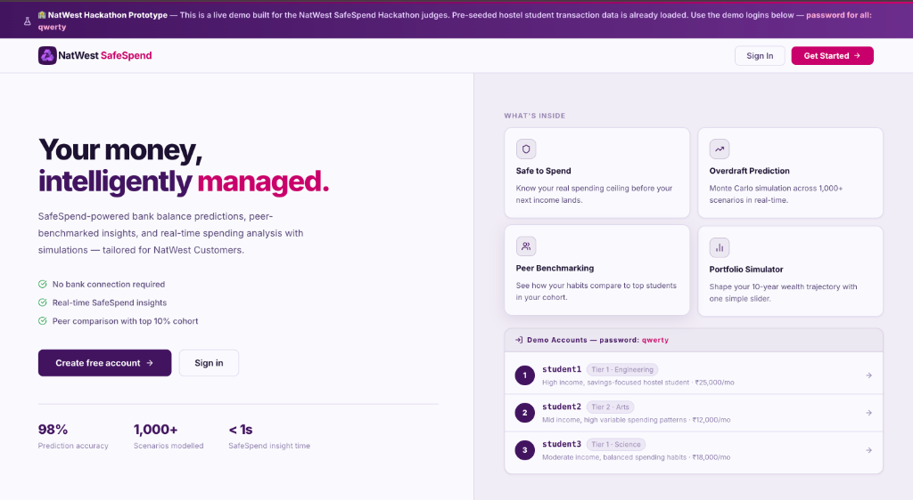
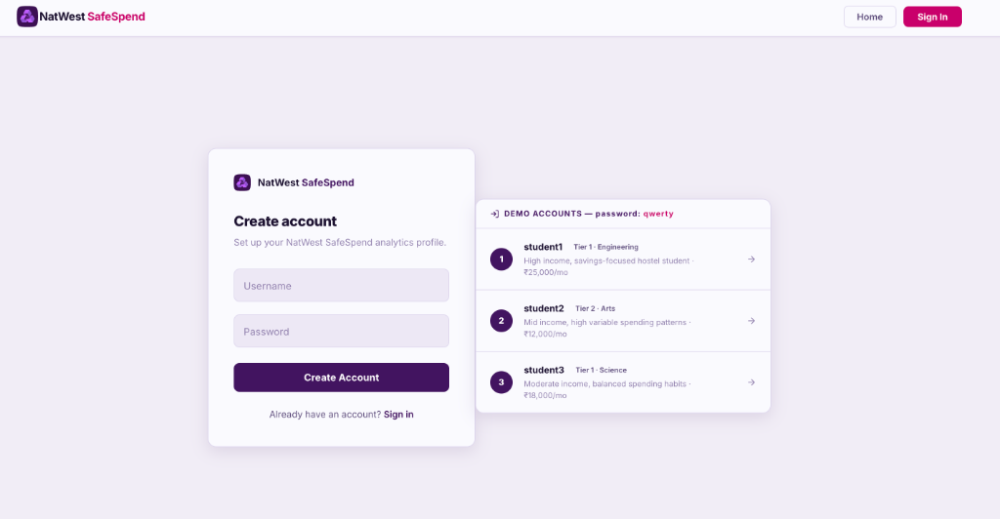
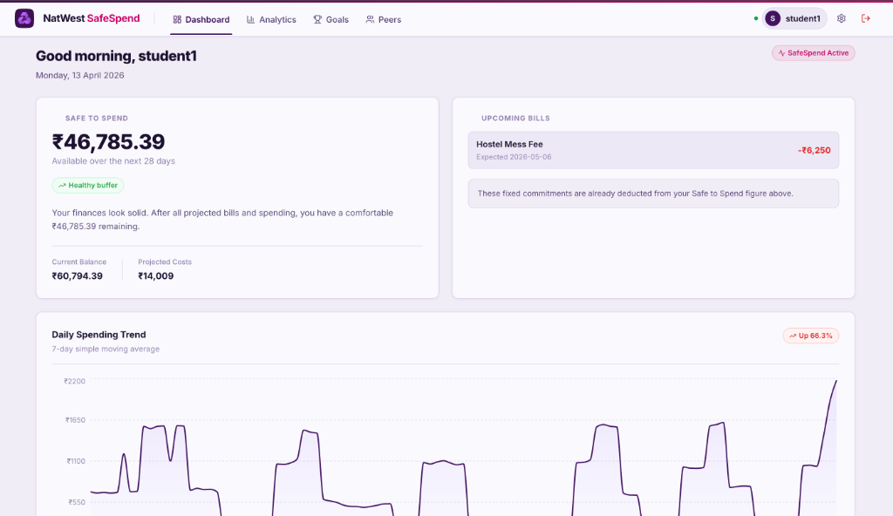
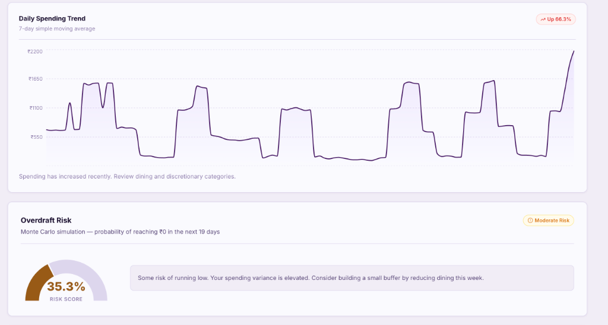
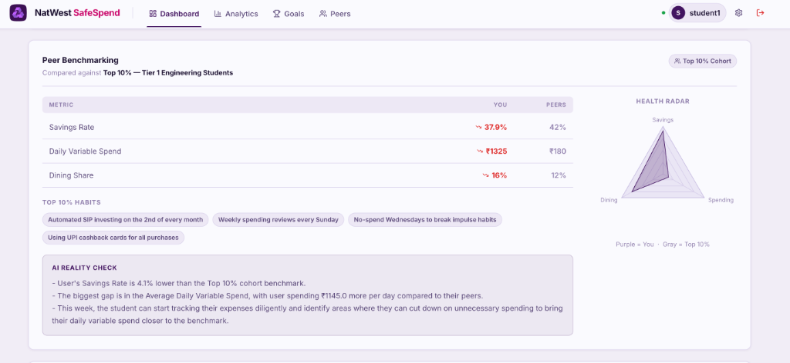

<div align="center">

# NatWest SafeSpend

**AI-powered personal finance analytics built for the NatWest Hackathon** — helping students and young professionals eliminate financial ambiguity, avoid accidental overdrafts, and benchmark their spending habits against top-performing peers.

[](#)
[](#)
[](#)
[](#)
[](#)

[**Live Demo →**](https://code-for-purpose-uf74.vercel.app/) · [**Getting Started**](#-local-development)

</div>

---

## The Problem

Students living on fixed monthly allowances frequently face a painfully simple question: *"Can I afford this?"* Traditional banking apps show a current balance but fail to account for upcoming bills, spending velocity, or peer context. The result? Unplanned overdrafts, anxiety, and poor financial habits that compound over decades.

## Our Solution

SafeSpend transforms raw transaction data into actionable intelligence. Instead of showing a static balance, it computes a **Safe to Spend** ceiling that aggressively pre-deducts upcoming bills, runs **Monte Carlo overdraft simulations** across 1,000+ scenarios in real-time, and leverages **LLM-powered agents** to deliver personalized, empathetic financial coaching — all benchmarked against the top 10% of a student's income cohort.

---

## App Walkthrough

### Landing Page
The entry point introduces SafeSpend's core value proposition and provides instant access to pre-seeded demo accounts for hackathon judges.

<div align="center">
  
</div>

---

### Signup & Demo Accounts
New users can create accounts instantly. For the hackathon demo, three pre-seeded student profiles are available with one-click access — each representing a different income tier and spending personality.

<div align="center">
  
</div>

---

### Dashboard — Safe to Spend & Spending Trend
The main dashboard surfaces two critical insights: a **Safe to Spend** balance (after deducting upcoming recurring bills) and a **7-day Simple Moving Average** spending trend chart that reveals whether expenses are accelerating or stabilizing.

<div align="center">
  
</div>

---

### Overdraft Risk & Spending Analysis
A deterministic **Monte Carlo simulation** engine runs 1,000 distinct financial pathways to forecast the probability of hitting ₹0 before the next income deposit. The risk score adapts dynamically based on real spending variance.

<div align="center">
  
</div>

---

### Peer Benchmarking & AI Reality Check
Students are compared against anonymized **top 10% performers** in their income and study cohort via a radar chart. An LLM-powered **AI Reality Check** then synthesizes the gap analysis into 3 concrete, actionable bullets — honest but encouraging.

<div align="center">
  
</div>

---

## Features

| Feature | Description |
|---------|-------------|
| **Safe to Spend** | Real-time balance forecast that pre-deducts upcoming recurring bills to show your *actual* spending ceiling |
| **Daily Spending Trend** | 7-day Simple Moving Average chart mapped against daily spending behavior |
| **Overdraft Risk Engine** | Monte Carlo simulation across 1,000 pathways — outputs a precise overdraft probability (e.g., "35.3% risk") |
| **Peer Benchmarking** | Radar chart contrasting user metrics against top 10% performers in their income/study cohort |
| **AI Reality Check** | LangGraph agent transforms raw analytics into personalized, empathetic financial coaching |
| **What-If Simulator** | Interactive slider to forecast how changing weekend spending habits influences 5-year or 10-year wealth trajectory |

---

## Tech Stack

| Layer | Technology |
|-------|------------|
| **Frontend** | React 19 + Vite, deployed globally on Vercel |
| **Backend** | Python 3.11, FastAPI + LangGraph, deployed on Render |
| **Database** | Neon (Serverless PostgreSQL) |
| **AI / NLP** | OpenAI GPT integration orchestrated via LangChain/LangGraph |

---

## Live Demo

| Service | URL |
|---------|-----|
| **Frontend** | [https://code-for-purpose-uf74.vercel.app/](https://code-for-purpose-uf74.vercel.app/) |
| **Backend** | Deployed on Render |

### Demo Accounts
Experience the platform using pre-seeded student profiles. Password for all accounts: **`qwerty`**

| Username | Profile |
|----------|---------|
| `student1` | Tier 1 · Engineering — High income, savings-focused hostel student · ₹25,000/mo |
| `student2` | Tier 2 · Arts — Mid income, high variable spending patterns · ₹12,000/mo |
| `student3` | Tier 1 · Science — Moderate income, balanced spending habits · ₹18,000/mo |

---

## 🛠 Local Development

### Prerequisites
- Python 3.11+
- Node.js 18+ and `npm`
- [uv](https://github.com/astral-sh/uv) (recommended for Python dependency management)
- A Neon Serverless Postgres Database URL
- An OpenAI API Key

### Backend Setup
```bash
cd backend
# Install dependencies using uv
uv sync
# Start the FastAPI server locally
uv run uvicorn app.main:app --reload
```
> **Environment Configuration**: Set `DATABASE_URL` and `OPENAI_API_KEY` in a `.env` file within the project root directory.

### Frontend Setup
```bash
cd frontend
# Install Node dependencies
npm install
# Start the Vite development server
npm run dev
```
> **Environment Configuration**: Set `VITE_API_URL=http://localhost:8000` in a `.env` file within the `frontend` directory for local backend connectivity.

---

## 🔐 Environment Variables Guide

### Backend (Render / Local)
| Variable | Description |
|----------|-------------|
| `DATABASE_URL` | Application's Neon PostgreSQL connection string |
| `OPENAI_API_KEY` | OpenAI API key utilized by LangGraph to generate insights |

### Frontend (Vercel / Local)
| Variable | Description |
|----------|-------------|
| `VITE_API_URL` | The URL of the connected Backend API. Should be pointed to your deployed Render URL in production environments. |